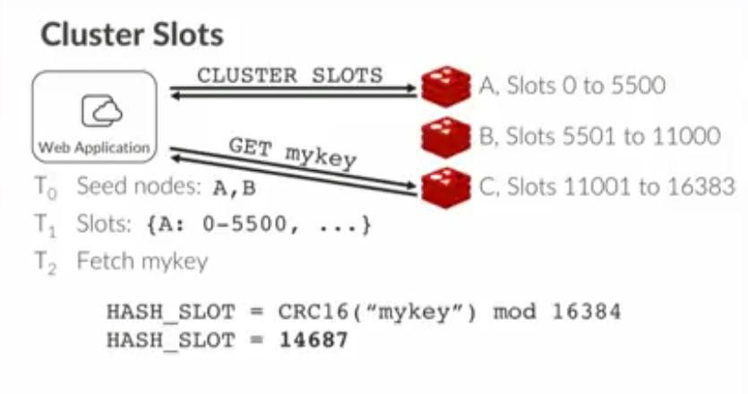
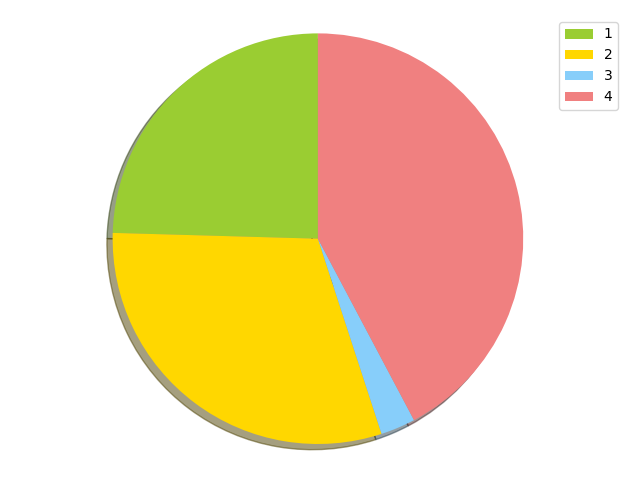
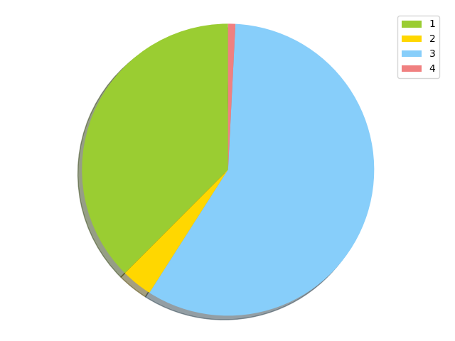
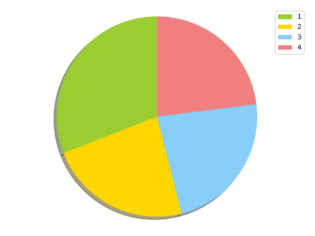

# Binpacking


## Bin Packing

The [bin packing problem](https://en.wikipedia.org/wiki/Bin_packing_problem) is about optimizing the distribution of weighted items to bins. Multiple variants exist, but our focus in this post is on distributing weights into a fixed number of bins. I like to think about Santa Claus getting ready to deliver presents the day before Christmas, and having his elves preparing the reindeers' carriages. We will imagine that many carriages are ready to be used, and that Santa will jump to a new one once he has delivered all the presents in his carriage.

The question is: *Depending on the size of the presents boxes, how should we distribute the load so that each carriage is as evenly distributed as possible*? Luckily a Python [library](https://pypi.org/project/binpacking/) exists for this algorithm (as always?) and the library interface is very simple and clear, as it uses Python dictionaries.

```
# We have 6 presents
b = { 'a': 10, 'b': 10, 'c':11, 'd':1, 'e': 2,'f':7 } # [name, weight] pairs, in a dictionary

# We want to pack them into 4 bins
# Assign each pair to its own bin, and return the list of bins as a result
bins = binpacking.to_constant_bin_number(b, 4)

# Print the result. Excuse the ugly uppercase Bin, but bin is a reserved function in Python
for Bin in bins:
    # We will print the sum of all the weights in the bin, along with the bin itself
    print(sum(Bin.values()), Bin)
```

Executing this program prints this on the console:

```
11 {'c': 11}
10 {'b': 10}
10 {'a': 10}
10 {'f': 7, 'e': 2, 'd': 1}
```

We have 4 bins with a weight of 10 or 11, so things are pretty well distributed. Now imagine that we were cycling through each objects in our original list of items b, and *picking the destination bin randomly*. The following program does that.

```
bins = [{} for _ in range(4)]     # Create 4 bins, each bin is a list of dictionaries

for name, weight in b.items():
    binIdx = random.randint(0,3)  # pick a random integer between 0 and 3
    bins[binIdx][name] = weight   # insert a 'present' into a bin
```

Let's run this 3 times.

```
# First try
9 {'e': 2, 'f': 7}
1 {'d': 1}
31 {'a': 10, 'b': 10, 'c': 11}
0 {}

# Second try
12 {'a': 10, 'e': 2}
18 {'c': 11, 'f': 7}
11 {'b': 10, 'd': 1}
0 {}

# Third try
0 {}
22 {'b': 10, 'c': 11, 'd': 1}
2 {'e': 2}
17 {'a': 10, 'f': 7}
```

This is pretty terrible; however, this is what randomly picking an item will give you.

## Redis Cluster

To quote its documentation, *Redis Cluster provides a way to run a Redis installation where data is automatically sharded across multiple Redis nodes*. [Redis cluster](https://redis.io/topics/cluster-tutorial) isn't only about sharding, but this is what we will focus on.

Every time you store something in Redis Cluster, it all starts by hashing the key of your object with a CRC16, modulo something, and then assigning a hash value to a slot, called a *hash slot*. There are 16384 hash slots in Redis Cluster. A good hash function should map the expected inputs as evenly as possible over its output range; that is 16384 hash slots in our case. That property is called [uniformity](https://en.wikipedia.org/wiki/Hash_function#Uniformity).

Each node in a cluster is responsible for a range of hash slots, and that assignment is usually done automatically early on, but the power of this system is that the assignment can be manual as well. If you know of a great way to distribute your hash slots to nodes, you can arrange for an optimal load balancing, and keep each Redis node as busy as possible.



**Just like you wouldn't want to have some reindeer do more work than others, you would not want some Redis machine have little work to do, while others are crazy busy**.

## Cobra

[Cobra](https://github.com/machinezone/cobra) is a real-time messaging system,
which we mainly use at [Machine Zone](https://www.mz.com/) for analytics. It
uses Redis internally, and store metrics events as JSON blobs into redis
streams.

Cobra internally keeps statistics about all channels, which helps us know which
ones are high frequency. This is displayed in the table below, along the Redis
hash slot for a given channel name. Notice that the CRC16 assigns unique
hash values for all our sample keys. We can also see that the distribution of published
items by channel name is uneven. If we were to randomly pick a channel and have
it processed by a random Redis node, *that would lead to inefficiencies*.

```
Channel name                                Published items         Redis Hash Slot
------------                                ---------------         ---------------
niso_engine_crash_id                                     16                    1732
niso_engine_fps_id                                    46889                    6454
niso_engine_graphics_device_info                       4284                    4050
niso_engine_lifecycle_id                              13444                     803
niso_engine_memory_used_id                            46745                     754
niso_engine_memory_warning_id                         14714                    3791
niso_engine_message_loop_id                            4251                    4152
niso_engine_net_request_error_id                       4356                   14143
niso_engine_net_request_id                           677400                    6417
niso_engine_net_traffic_id                             4322                    7208
niso_engine_payload_id                               163277                   11316
niso_engine_performance_metrics_id                     5585                    7132
niso_engine_rml_load_document_metrics_id             360998                    2476
niso_engine_rml_navigation_id                        485541                   14863
niso_engine_rocket_log_id                              3811                    9883
niso_engine_selfupdate_storage_error_id                   2                    4959
niso_engine_set_asset_build_id                         4339                    6884
niso_engine_set_cdn_idx_id                             4392                   15400
niso_game_chat_events_id                               9307                    6629
niso_game_logging_id                                    685                    3247
niso_game_lua_health_id                              176710                   15535
niso_game_lua_health_mem_warning                        264                   16311
niso_game_lua_health_minutes                          43157                     687
niso_game_lua_health_threshold                         2410                    6831
niso_game_noisytypes_id                              103027                   15422
niso_game_pubsub_events_id                             8701                    2221
niso_game_unexpected_termination_id                     518                    7627
niso_game_user_actions_id                                46                    7092
niso_sms_set_rate_control_id                              7                    3113
```

Let's try to do the channel to hash slot assignment randomly, as it would be done if we were not assigning hash slots to Redis nodes manually.

### Random distribution 1

```
537399 {'niso_engine_rml_navigation_id': 485541, 'niso_game_lua_health_minutes': 43157, 'niso_game_pubsub_events_id': 8701}
667035 {'niso_engine_crash_id': 16, 'niso_engine_graphics_device_info': 4284, 'niso_engine_memory_warning_id': 14714, 'niso_engine_net_request_error_id': 4356, 'niso_engine_rml_load_document_metrics_id': 360998, 'niso_engine_selfupdate_storage_error_id': 2, 'niso_game_lua_health_id': 176710, 'niso_game_lua_health_threshold': 2410, 'niso_game_noisytypes_id': 103027, 'niso_game_unexpected_termination_id': 518}
59884 {'niso_engine_memory_used_id': 46745, 'niso_engine_message_loop_id': 4251, 'niso_engine_rocket_log_id': 3811, 'niso_engine_set_asset_build_id': 4339, 'niso_game_logging_id': 685, 'niso_game_user_actions_id': 46, 'niso_sms_set_rate_control_id': 7}
924880 {'niso_engine_fps_id': 46889, 'niso_engine_lifecycle_id': 13444, 'niso_engine_net_request_id': 677400, 'niso_engine_net_traffic_id': 4322, 'niso_engine_payload_id': 163277, 'niso_engine_performance_metrics_id': 5585, 'niso_engine_set_cdn_idx_id': 4392, 'niso_game_chat_events_id': 9307, 'niso_game_lua_health_mem_warning': 264}
stdev 376758.0808394682
```

We will represent this visually, using a pie chart. The excellent [matplotlib](https://matplotlib.org/) library can plot this for us.

```
labels = ['1', '2', '3', '4']
S = sum(weights)
sizes = [100 * weight / S for weight in weights]
colors = ['yellowgreen', 'gold', 'lightskyblue', 'lightcoral']
patches, texts = plt.pie(sizes, colors=colors, shadow=True, startangle=90)
plt.legend(patches, labels, loc="best")
plt.axis('equal')
plt.tight_layout()
plt.show()
```



This isn't a great distribution. Node 3 got very few hash slots assigned, while Node 4 seems to do too much work.

### Random distribution 2

```
821388 {'niso_engine_message_loop_id': 4251, 'niso_engine_payload_id': 163277, 'niso_engine_performance_metrics_id': 5585, 'niso_engine_rml_load_document_metrics_id': 360998, 'niso_engine_set_cdn_idx_id': 4392, 'niso_game_logging_id': 685, 'niso_game_lua_health_id': 176710, 'niso_game_lua_health_threshold': 2410, 'niso_game_noisytypes_id': 103027, 'niso_game_user_actions_id': 46, 'niso_sms_set_rate_control_id': 7}
75311 {'niso_engine_memory_warning_id': 14714, 'niso_engine_net_traffic_id': 4322, 'niso_engine_rocket_log_id': 3811, 'niso_game_chat_events_id': 9307, 'niso_game_lua_health_minutes': 43157}
1274894 {'niso_engine_crash_id': 16, 'niso_engine_fps_id': 46889, 'niso_engine_lifecycle_id': 13444, 'niso_engine_memory_used_id': 46745, 'niso_engine_net_request_id': 677400, 'niso_engine_rml_navigation_id': 485541, 'niso_engine_selfupdate_storage_error_id': 2, 'niso_engine_set_asset_build_id': 4339, 'niso_game_unexpected_termination_id': 518}
17605 {'niso_engine_graphics_device_info': 4284, 'niso_engine_net_request_error_id': 4356, 'niso_game_lua_health_mem_warning': 264, 'niso_game_pubsub_events_id': 8701}
stdev 493807.17986663507
```



This one is even worse; Node 3 got assigned a lot of slots, pretty bad. Ideally we would want to see a pie chart with four somewhat equal quadrants.

However, if we can find in which hash slot each channel traffic will land, and use the published count as a weight for that channel, **we can allocate that channel to be handled by a Redis Cluster node using the Bin Packing algorithm**. This will give us a more **fair or optimal** load balancing.

2 Redis commands are required to do that:

* The [CLUSTER KEYSLOT](https://redis.io/commands/cluster-keyslot) command run the CRC16 hash on a key.
* The [CLUSTER SETSLOT](https://redis.io/commands/cluster-keyslot) command will be used to allocate a hash slot to a Redis cluster node. Practically speaking, it is easier to use the redis-cli command which can do that for us, and handle the resharding better. Here are all the things that the CLI can do for you.

```
$ redis-cli --cluster help
Cluster Manager Commands:
  create         host1:port1 ... hostN:portN
                 --cluster-replicas <arg>
  check          host:port
                 --cluster-search-multiple-owners
  info           host:port
  fix            host:port
                 --cluster-search-multiple-owners
  reshard        host:port
                 --cluster-from <arg>
                 --cluster-to <arg>
                 --cluster-slots <arg>
                 --cluster-yes
                 --cluster-timeout <arg>
                 --cluster-pipeline <arg>
                 --cluster-replace
  rebalance      host:port
                 --cluster-weight <node1=w1...nodeN=wN>
                 --cluster-use-empty-masters
                 --cluster-timeout <arg>
                 --cluster-simulate
                 --cluster-pipeline <arg>
                 --cluster-threshold <arg>
                 --cluster-replace
  add-node       new_host:new_port existing_host:existing_port
                 --cluster-slave
                 --cluster-master-id <arg>
  del-node       host:port node_id
  call           host:port command arg arg .. arg
  set-timeout    host:port milliseconds
  import         host:port
                 --cluster-from <arg>
                 --cluster-copy
                 --cluster-replace
  help
```

Back to the bin-packing algorithm, let's see how it performs on our own real data set, which is a less contrived than the one we used in our first example.

### Bin packing distribution

```
677400 {'niso_engine_net_request_id': 677400}
503781 {'niso_engine_rml_navigation_id': 485541, 'niso_game_pubsub_events_id': 8701, 'niso_engine_set_asset_build_id': 4339, 'niso_engine_message_loop_id': 4251, 'niso_game_logging_id': 685, 'niso_game_lua_health_mem_warning': 264}
503736 {'niso_engine_rml_load_document_metrics_id': 360998, 'niso_engine_fps_id': 46889, 'niso_engine_memory_used_id': 46745, 'niso_engine_memory_warning_id': 14714, 'niso_engine_lifecycle_id': 13444, 'niso_game_chat_events_id': 9307, 'niso_engine_net_request_error_id': 4356, 'niso_engine_graphics_device_info': 4284, 'niso_game_lua_health_threshold': 2410, 'niso_game_unexpected_termination_id': 518, 'niso_game_user_actions_id': 46, 'niso_engine_crash_id': 16, 'niso_sms_set_rate_control_id': 7, 'niso_engine_selfupdate_storage_error_id': 2}
504281 {'niso_game_lua_health_id': 176710, 'niso_engine_payload_id': 163277, 'niso_game_noisytypes_id': 103027, 'niso_game_lua_health_minutes': 43157, 'niso_engine_performance_metrics_id': 5585, 'niso_engine_set_cdn_idx_id': 4392, 'niso_engine_net_traffic_id': 4322, 'niso_engine_rocket_log_id': 3811}
```

Our 4 bins receive around 500,000 units of weight each. If we visualize this with a pie chart, this feels like a pretty fair repartition.



## Conclusion

If you can *efficiently analyze your key space*, the *flexible* Redis Cluster hash slot design lets you do wonders and achieve an excellent *load balancing*. This leads to less CPU cycles burnt for nothing, which leads to melting the ice cap perhaps a bit more slowly, which in turn lets Santa live the life to which he is accustomed to in the North Pole for the foreseeable future.


