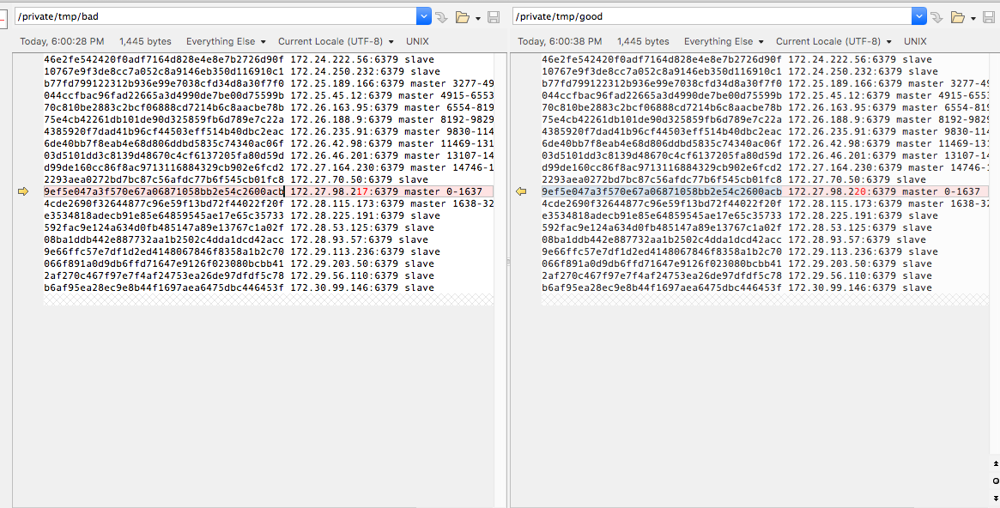

# Cluster Ips



## Problem

Sometimes a redis cluster node dies, and kubernetes restarts it for you. And when this happens sometimes your pod will get a new ip address. However Redis read the cluster config from a file, nodes.conf, and that file could have the old value prior to the restart.

## Solution

### The nice way

This can be fixed automatically, so that when redis start it updates its ip address in nodes.conf with the one currently assigned. A nice way to do that is explained in this [guide](https://github.com/rustudorcalin/deploying-redis-cluster). Essentially we use a configmap that contain the script, and use that to start redis-server. An environment variable containing the pod ip is setup with this magic, in the deployment config file.

```
env:
- name: POD_IP
  valueFrom:
    fieldRef:
      fieldPath: status.podIP
```

The shell script regexp is from the update-node.sh.

```
#!/bin/sh
REDIS_NODES="/data/nodes.conf"
sed -i -e "/myself/ s/[0-9]\{1,3\}\.[0-9]\{1,3\}\.[0-9]\{1,3\}\.[0-9]\{1,3\}/${POD_IP}/" ${REDIS_NODES}
exec "$@"
```

Don't ask me to debug this regexp :)

### The lame way

However sometimes you just want to fix things manually, before you automate them. To do that it is as simple as editing the script with an editor, and shutting down the node with `redis-cli SHUTDOWN`.

I figured this out thanks to the new [rcc](https://github.com/machinezone/rcc/) cluster-check command, while trying to reshard my cluster.

```
~ $ rcc
Usage: rcc [OPTIONS] COMMAND [ARGS]...

  RCC

  Rcc is a Redis Cluster Client

Options:
  --version      Show the version and exit.
  -v, --verbose
  --help         Show this message and exit.

Commands:
  keyspace  Subscribe to a channel rcc keyspace...
  cli               cli tool similar to redis-cli
  cluster-check     Similar to redis-cli --cluster check Make sure all
                    nodes...
  cluster-info      Monitor redis metrics rcc cluster-info --stats...
  cluster-init
  cluster-nodes     Monitor redis metrics rcc cluster-nodes
  endpoints         Print endpoints associated with a redis cluster service
  make-cluster
  migrate
  publish           Publish to a channel
  reshard           Reshard using the bin-packing technique
  sub               Subscribe to a channel rcc sub --redis_url...
  subscribe         Subscribe to a channel rcc subscribe --redis_url...
~ $ rcc --version
rcc, version 0.7.4
~ $ rcc cluster-check --redis_url redis://172.24.222.56:6379
cluster unhealthy. Re-run with -v
```

To get details you can rerun with the verbose flag, whose alias is -v. Then
it's a bit painful but you'll need to visually scan for the nodes whose
signature are different. This could be because slots assignments are differents
between nodes, or if slave/masters assignments differs.

```
~ $ rcc -v cluster-check --redis_url redis://172.24.222.56:6379
2020-02-26 01:58:53 INFO redis://172.24.222.56:6379 5f9bcb66a8e67859342aa614082f1b24 balanced True coverage True
2020-02-26 01:58:53 INFO
46e2fe542420f0adf7164d828e4e8e7b2726d90f 172.24.222.56:6379 slave
10767e9f3de8cc7a052c8a9146eb350d116910c1 172.24.250.232:6379 slave
b77fd799122312b936e99e7038cfd34d8a30f7f0 172.25.189.166:6379 master 3277-4914
044ccfbac96fad22665a3d4990de7be00d75599b 172.25.45.12:6379 master 4915-6553
70c810be2883c2bcf06888cd7214b6c8aacbe78b 172.26.163.95:6379 master 6554-8191
75e4cb42261db101de90d325859fb6d789e7c22a 172.26.188.9:6379 master 8192-9829
4385920f7dad41b96cf44503eff514b40dbc2eac 172.26.235.91:6379 master 9830-11468
6de40bb7f8eab4e68d806ddbd5835c74340ac06f 172.26.42.98:6379 master 11469-13106
03d5101dd3c8139d48670c4cf6137205fa80d59d 172.26.46.201:6379 master 13107-14745
d99de160cc86f8ac9713116884329cb902e6fcd2 172.27.164.230:6379 master 14746-16383
2293aea0272bd7bc87c56afdc77b6f545cb01fc8 172.27.70.50:6379 slave
9ef5e047a3f570e67a06871058bb2e54c2600acb 172.27.98.220:6379 master 0-1637
4cde2690f32644877c96e59f13bd72f44022f20f 172.28.115.173:6379 master 1638-3276
e3534818adecb91e85e64859545ae17e65c35733 172.28.225.191:6379 slave
592fac9e124a634d0fb485147a89e13767c1a02f 172.28.53.125:6379 slave
08ba1ddb442e887732aa1b2502c4dda1dcd42acc 172.28.93.57:6379 slave
9e66ffc57e7df1d2ed4148067846f8358a1b2c70 172.29.113.236:6379 slave
066f891a0d9db6ffd71647e9126f023080bcbb41 172.29.203.50:6379 slave
2af270c467f97e7f4af24753ea26de97dfdf5c78 172.29.56.110:6379 slave
b6af95ea28ec9e8b44f1697aea6475dbc446453f 172.30.99.146:6379 slave

... output trimmed for readability

2020-02-26 01:58:53 INFO redis://172.27.70.50:6379 5f9bcb66a8e67859342aa614082f1b24 balanced True coverage True
2020-02-26 01:58:53 INFO
46e2fe542420f0adf7164d828e4e8e7b2726d90f 172.24.222.56:6379 slave
10767e9f3de8cc7a052c8a9146eb350d116910c1 172.24.250.232:6379 slave
b77fd799122312b936e99e7038cfd34d8a30f7f0 172.25.189.166:6379 master 3277-4914
044ccfbac96fad22665a3d4990de7be00d75599b 172.25.45.12:6379 master 4915-6553
70c810be2883c2bcf06888cd7214b6c8aacbe78b 172.26.163.95:6379 master 6554-8191
75e4cb42261db101de90d325859fb6d789e7c22a 172.26.188.9:6379 master 8192-9829
4385920f7dad41b96cf44503eff514b40dbc2eac 172.26.235.91:6379 master 9830-11468
6de40bb7f8eab4e68d806ddbd5835c74340ac06f 172.26.42.98:6379 master 11469-13106
03d5101dd3c8139d48670c4cf6137205fa80d59d 172.26.46.201:6379 master 13107-14745
d99de160cc86f8ac9713116884329cb902e6fcd2 172.27.164.230:6379 master 14746-16383
2293aea0272bd7bc87c56afdc77b6f545cb01fc8 172.27.70.50:6379 slave
9ef5e047a3f570e67a06871058bb2e54c2600acb 172.27.98.220:6379 master 0-1637
4cde2690f32644877c96e59f13bd72f44022f20f 172.28.115.173:6379 master 1638-3276
e3534818adecb91e85e64859545ae17e65c35733 172.28.225.191:6379 slave
592fac9e124a634d0fb485147a89e13767c1a02f 172.28.53.125:6379 slave
08ba1ddb442e887732aa1b2502c4dda1dcd42acc 172.28.93.57:6379 slave
9e66ffc57e7df1d2ed4148067846f8358a1b2c70 172.29.113.236:6379 slave
066f891a0d9db6ffd71647e9126f023080bcbb41 172.29.203.50:6379 slave
2af270c467f97e7f4af24753ea26de97dfdf5c78 172.29.56.110:6379 slave
b6af95ea28ec9e8b44f1697aea6475dbc446453f 172.30.99.146:6379 slave

2020-02-26 01:58:53 INFO redis://172.27.98.220:6379 bad1c3a12e48191a830d21cc9f855ed7 balanced True coverage True
2020-02-26 01:58:53 INFO
46e2fe542420f0adf7164d828e4e8e7b2726d90f 172.24.222.56:6379 slave
10767e9f3de8cc7a052c8a9146eb350d116910c1 172.24.250.232:6379 slave
b77fd799122312b936e99e7038cfd34d8a30f7f0 172.25.189.166:6379 master 3277-4914
044ccfbac96fad22665a3d4990de7be00d75599b 172.25.45.12:6379 master 4915-6553
70c810be2883c2bcf06888cd7214b6c8aacbe78b 172.26.163.95:6379 master 6554-8191
75e4cb42261db101de90d325859fb6d789e7c22a 172.26.188.9:6379 master 8192-9829
4385920f7dad41b96cf44503eff514b40dbc2eac 172.26.235.91:6379 master 9830-11468
6de40bb7f8eab4e68d806ddbd5835c74340ac06f 172.26.42.98:6379 master 11469-13106
03d5101dd3c8139d48670c4cf6137205fa80d59d 172.26.46.201:6379 master 13107-14745
d99de160cc86f8ac9713116884329cb902e6fcd2 172.27.164.230:6379 master 14746-16383
2293aea0272bd7bc87c56afdc77b6f545cb01fc8 172.27.70.50:6379 slave
9ef5e047a3f570e67a06871058bb2e54c2600acb 172.27.98.217:6379 master 0-1637
4cde2690f32644877c96e59f13bd72f44022f20f 172.28.115.173:6379 master 1638-3276
e3534818adecb91e85e64859545ae17e65c35733 172.28.225.191:6379 slave
592fac9e124a634d0fb485147a89e13767c1a02f 172.28.53.125:6379 slave
08ba1ddb442e887732aa1b2502c4dda1dcd42acc 172.28.93.57:6379 slave
9e66ffc57e7df1d2ed4148067846f8358a1b2c70 172.29.113.236:6379 slave
066f891a0d9db6ffd71647e9126f023080bcbb41 172.29.203.50:6379 slave
2af270c467f97e7f4af24753ea26de97dfdf5c78 172.29.56.110:6379 slave
b6af95ea28ec9e8b44f1697aea6475dbc446453f 172.30.99.146:6379 slave

2020-02-26 01:58:53 INFO redis://172.28.115.173:6379 5f9bcb66a8e67859342aa614082f1b24 balanced True coverage True
2020-02-26 01:58:53 INFO
46e2fe542420f0adf7164d828e4e8e7b2726d90f 172.24.222.56:6379 slave
10767e9f3de8cc7a052c8a9146eb350d116910c1 172.24.250.232:6379 slave
b77fd799122312b936e99e7038cfd34d8a30f7f0 172.25.189.166:6379 master 3277-4914
044ccfbac96fad22665a3d4990de7be00d75599b 172.25.45.12:6379 master 4915-6553
70c810be2883c2bcf06888cd7214b6c8aacbe78b 172.26.163.95:6379 master 6554-8191
75e4cb42261db101de90d325859fb6d789e7c22a 172.26.188.9:6379 master 8192-9829
4385920f7dad41b96cf44503eff514b40dbc2eac 172.26.235.91:6379 master 9830-11468
6de40bb7f8eab4e68d806ddbd5835c74340ac06f 172.26.42.98:6379 master 11469-13106
03d5101dd3c8139d48670c4cf6137205fa80d59d 172.26.46.201:6379 master 13107-14745
d99de160cc86f8ac9713116884329cb902e6fcd2 172.27.164.230:6379 master 14746-16383
2293aea0272bd7bc87c56afdc77b6f545cb01fc8 172.27.70.50:6379 slave
9ef5e047a3f570e67a06871058bb2e54c2600acb 172.27.98.220:6379 master 0-1637
4cde2690f32644877c96e59f13bd72f44022f20f 172.28.115.173:6379 master 1638-3276
e3534818adecb91e85e64859545ae17e65c35733 172.28.225.191:6379 slave
592fac9e124a634d0fb485147a89e13767c1a02f 172.28.53.125:6379 slave
08ba1ddb442e887732aa1b2502c4dda1dcd42acc 172.28.93.57:6379 slave
9e66ffc57e7df1d2ed4148067846f8358a1b2c70 172.29.113.236:6379 slave
066f891a0d9db6ffd71647e9126f023080bcbb41 172.29.203.50:6379 slave
2af270c467f97e7f4af24753ea26de97dfdf5c78 172.29.56.110:6379 slave
b6af95ea28ec9e8b44f1697aea6475dbc446453f 172.30.99.146:6379 slave

...

2020-02-26 01:58:53 INFO 2 unique signatures
cluster unhealthy. Re-run with -v
~ $
```

First we need to know which node has the broken ip, so that we can connect to it. I'll use `oc get -o yaml endpoints redis-cluster`

```
  - ip: 172.27.98.220
    nodeName: blah-blah-blah.example.com
    targetRef:
      kind: Pod
      name: redis-cluster-2-sl2wf
      namespace: cobra-live
      resourceVersion: "1568323619"
      uid: 4e174e94-4143-11ea-b4fb-eeeeeeeeeeee
```

Now I know I need to rsh to `redis-cluster-2-sl2wf`. Once we've done that, we'll just need some vim/insert your favorite editor magic, to use the '172.27.98.220' address for the 'myself' node (the one where we are connected).

The node will be rebooted, and we can ssh to it and grep for the new ip address.

```
root@redis-cluster-2-sl2wf:/data# grep 220 nodes.conf
9ef5e047a3f570e67a06871058bb2e54c2600acb 172.27.98.220:6379@16379 myself,master - 0 1582064573000 22 connected 0-1637
```

It's the right now. Let's re-run the cluster-check command, it will happilly succeed.

```
~ $
~ $
~ $
~ $
~ $ rcc -v cluster-check --redis_url redis://172.24.222.56:6379
2020-02-26 02:11:44 INFO redis://172.24.222.56:6379 5f9bcb66a8e67859342aa614082f1b24 balanced True coverage True
2020-02-26 02:11:44 INFO
46e2fe542420f0adf7164d828e4e8e7b2726d90f 172.24.222.56:6379 slave
10767e9f3de8cc7a052c8a9146eb350d116910c1 172.24.250.232:6379 slave
b77fd799122312b936e99e7038cfd34d8a30f7f0 172.25.189.166:6379 master 3277-4914
044ccfbac96fad22665a3d4990de7be00d75599b 172.25.45.12:6379 master 4915-6553
70c810be2883c2bcf06888cd7214b6c8aacbe78b 172.26.163.95:6379 master 6554-8191
75e4cb42261db101de90d325859fb6d789e7c22a 172.26.188.9:6379 master 8192-9829
4385920f7dad41b96cf44503eff514b40dbc2eac 172.26.235.91:6379 master 9830-11468
6de40bb7f8eab4e68d806ddbd5835c74340ac06f 172.26.42.98:6379 master 11469-13106
03d5101dd3c8139d48670c4cf6137205fa80d59d 172.26.46.201:6379 master 13107-14745
d99de160cc86f8ac9713116884329cb902e6fcd2 172.27.164.230:6379 master 14746-16383
2293aea0272bd7bc87c56afdc77b6f545cb01fc8 172.27.70.50:6379 slave
9ef5e047a3f570e67a06871058bb2e54c2600acb 172.27.98.220:6379 master 0-1637
4cde2690f32644877c96e59f13bd72f44022f20f 172.28.115.173:6379 master 1638-3276
e3534818adecb91e85e64859545ae17e65c35733 172.28.225.191:6379 slave
592fac9e124a634d0fb485147a89e13767c1a02f 172.28.53.125:6379 slave
08ba1ddb442e887732aa1b2502c4dda1dcd42acc 172.28.93.57:6379 slave
9e66ffc57e7df1d2ed4148067846f8358a1b2c70 172.29.113.236:6379 slave
066f891a0d9db6ffd71647e9126f023080bcbb41 172.29.203.50:6379 slave
2af270c467f97e7f4af24753ea26de97dfdf5c78 172.29.56.110:6379 slave
b6af95ea28ec9e8b44f1697aea6475dbc446453f 172.30.99.146:6379 slave

... edited for clarity ...

2020-02-26 02:11:45 INFO redis://172.30.99.146:6379 5f9bcb66a8e67859342aa614082f1b24 balanced True coverage True
2020-02-26 02:11:45 INFO
46e2fe542420f0adf7164d828e4e8e7b2726d90f 172.24.222.56:6379 slave
10767e9f3de8cc7a052c8a9146eb350d116910c1 172.24.250.232:6379 slave
b77fd799122312b936e99e7038cfd34d8a30f7f0 172.25.189.166:6379 master 3277-4914
044ccfbac96fad22665a3d4990de7be00d75599b 172.25.45.12:6379 master 4915-6553
70c810be2883c2bcf06888cd7214b6c8aacbe78b 172.26.163.95:6379 master 6554-8191
75e4cb42261db101de90d325859fb6d789e7c22a 172.26.188.9:6379 master 8192-9829
4385920f7dad41b96cf44503eff514b40dbc2eac 172.26.235.91:6379 master 9830-11468
6de40bb7f8eab4e68d806ddbd5835c74340ac06f 172.26.42.98:6379 master 11469-13106
03d5101dd3c8139d48670c4cf6137205fa80d59d 172.26.46.201:6379 master 13107-14745
d99de160cc86f8ac9713116884329cb902e6fcd2 172.27.164.230:6379 master 14746-16383
2293aea0272bd7bc87c56afdc77b6f545cb01fc8 172.27.70.50:6379 slave
9ef5e047a3f570e67a06871058bb2e54c2600acb 172.27.98.220:6379 master 0-1637
4cde2690f32644877c96e59f13bd72f44022f20f 172.28.115.173:6379 master 1638-3276
e3534818adecb91e85e64859545ae17e65c35733 172.28.225.191:6379 slave
592fac9e124a634d0fb485147a89e13767c1a02f 172.28.53.125:6379 slave
08ba1ddb442e887732aa1b2502c4dda1dcd42acc 172.28.93.57:6379 slave
9e66ffc57e7df1d2ed4148067846f8358a1b2c70 172.29.113.236:6379 slave
066f891a0d9db6ffd71647e9126f023080bcbb41 172.29.203.50:6379 slave
2af270c467f97e7f4af24753ea26de97dfdf5c78 172.29.56.110:6379 slave
b6af95ea28ec9e8b44f1697aea6475dbc446453f 172.30.99.146:6379 slave

2020-02-26 02:11:45 INFO 1 unique signatures
cluster ok
~ $
~ $
```

Hooray ! Now we can finally reshard the cluster since it is in a good state.

# Resharding

```
~ $
~ $ rcc reshard --redis_url redis://172.24.222.56:6379
file descriptors ulimit: 1048576
resharding can be hungry, bump it with ulimit -n if needed
== b77fd799122312b936e99e7038cfd34d8a30f7f0 / 172.25.189.166:6379 ==
migrated 0 slots
Waiting for cluster view to be consistent...
.== 044ccfbac96fad22665a3d4990de7be00d75599b / 172.25.45.12:6379 ==
migrated 0 slots
Waiting for cluster view to be consistent...
.== 70c810be2883c2bcf06888cd7214b6c8aacbe78b / 172.26.163.95:6379 ==
migrated 1 slots
Waiting for cluster view to be consistent...
........== 75e4cb42261db101de90d325859fb6d789e7c22a / 172.26.188.9:6379 ==
migrated 1 slots
Waiting for cluster view to be consistent...
..........== 4385920f7dad41b96cf44503eff514b40dbc2eac / 172.26.235.91:6379 ==
migrated 1 slots
Waiting for cluster view to be consistent...
.......2020-02-26 02:34:37 ERROR timeout exceeded
~ $
~ $
~ $ rcc reshard --redis_url redis://172.24.222.56:6379 --timeout 30
file descriptors ulimit: 1048576
resharding can be hungry, bump it with ulimit -n if needed
== b77fd799122312b936e99e7038cfd34d8a30f7f0 / 172.25.189.166:6379 ==
migrated 0 slots
Waiting for cluster view to be consistent...
.== 044ccfbac96fad22665a3d4990de7be00d75599b / 172.25.45.12:6379 ==
migrated 0 slots
Waiting for cluster view to be consistent...
.== 70c810be2883c2bcf06888cd7214b6c8aacbe78b / 172.26.163.95:6379 ==
migrated 0 slots
Waiting for cluster view to be consistent...
.== 75e4cb42261db101de90d325859fb6d789e7c22a / 172.26.188.9:6379 ==
migrated 0 slots
Waiting for cluster view to be consistent...
.== 4385920f7dad41b96cf44503eff514b40dbc2eac / 172.26.235.91:6379 ==
migrated 0 slots
Waiting for cluster view to be consistent...
.== 6de40bb7f8eab4e68d806ddbd5835c74340ac06f / 172.26.42.98:6379 ==
migrated 1 slots
Waiting for cluster view to be consistent...
...............== 03d5101dd3c8139d48670c4cf6137205fa80d59d / 172.26.46.201:6379 ==
migrating 2 keys
migrated 6 slots
Waiting for cluster view to be consistent...
........== d99de160cc86f8ac9713116884329cb902e6fcd2 / 172.27.164.230:6379 ==
migrated 4 slots
Waiting for cluster view to be consistent...
.........== 9ef5e047a3f570e67a06871058bb2e54c2600acb / 172.27.98.220:6379 ==
migrated 6 slots
Waiting for cluster view to be consistent...
.......== 4cde2690f32644877c96e59f13bd72f44022f20f / 172.28.115.173:6379 ==
migrated 7 slots
Waiting for cluster view to be consistent...
...........2020-02-26 02:35:26 ERROR timeout exceeded
~ $
~ $
~ $
~ $
~ $ rcc reshard --redis_url redis://172.24.222.56:6379 --timeout 45
file descriptors ulimit: 1048576
resharding can be hungry, bump it with ulimit -n if needed
== b77fd799122312b936e99e7038cfd34d8a30f7f0 / 172.25.189.166:6379 ==
migrated 0 slots
Waiting for cluster view to be consistent...
.== 044ccfbac96fad22665a3d4990de7be00d75599b / 172.25.45.12:6379 ==
migrated 0 slots
Waiting for cluster view to be consistent...
.== 70c810be2883c2bcf06888cd7214b6c8aacbe78b / 172.26.163.95:6379 ==
migrated 0 slots
Waiting for cluster view to be consistent...
.== 75e4cb42261db101de90d325859fb6d789e7c22a / 172.26.188.9:6379 ==
migrated 0 slots
Waiting for cluster view to be consistent...
.== 4385920f7dad41b96cf44503eff514b40dbc2eac / 172.26.235.91:6379 ==
migrated 0 slots
Waiting for cluster view to be consistent...
.== 6de40bb7f8eab4e68d806ddbd5835c74340ac06f / 172.26.42.98:6379 ==
migrated 0 slots
Waiting for cluster view to be consistent...
.== 03d5101dd3c8139d48670c4cf6137205fa80d59d / 172.26.46.201:6379 ==
migrated 0 slots
Waiting for cluster view to be consistent...
.== d99de160cc86f8ac9713116884329cb902e6fcd2 / 172.27.164.230:6379 ==
migrated 0 slots
Waiting for cluster view to be consistent...
.== 9ef5e047a3f570e67a06871058bb2e54c2600acb / 172.27.98.220:6379 ==
migrated 0 slots
Waiting for cluster view to be consistent...
.== 4cde2690f32644877c96e59f13bd72f44022f20f / 172.28.115.173:6379 ==
migrated 0 slots
Waiting for cluster view to be consistent...
.total migrated slots: 0
~ $
~ $
~ $
~ $
~ $
~ $ rcc cluster-check --redis_url redis://172.24.222.56:6379
cluster ok
~ $
~ $
~ $
~ $ rcc cluster-nodes --redis_url redis://172.24.222.56:6379
Usage: rcc cluster-nodes [OPTIONS]
Try "rcc cluster-nodes --help" for help.

Error: no such option: --redis_url  Did you mean --redis_urls?
~ $ rcc cluster-nodes --redis_urls redis://172.24.222.56:6379
46e2fe542420f0adf7164d828e4e8e7b2726d90f 172.24.222.56:6379 slave
10767e9f3de8cc7a052c8a9146eb350d116910c1 172.24.250.232:6379 slave
b77fd799122312b936e99e7038cfd34d8a30f7f0 172.25.189.166:6379 master 3277-4261 4263-4279 4281-4914
044ccfbac96fad22665a3d4990de7be00d75599b 172.25.45.12:6379 master 4915-5707 5709-6305 6307-6504 6506-6553 11364
70c810be2883c2bcf06888cd7214b6c8aacbe78b 172.26.163.95:6379 master 6505 6554-7285 7287-7431 7433-7723 7725-8191
75e4cb42261db101de90d325859fb6d789e7c22a 172.26.188.9:6379 master 7432 8192-8282 8284-9091 9093-9829
4385920f7dad41b96cf44503eff514b40dbc2eac 172.26.235.91:6379 master 445 9830-10695 10697-10819 10821-11039 11041-11107 11109-11184 11186-11363 11365-11468
6de40bb7f8eab4e68d806ddbd5835c74340ac06f 172.26.42.98:6379 master 11469-13106 15288
03d5101dd3c8139d48670c4cf6137205fa80d59d 172.26.46.201:6379 master 943 3145 5708 7724 13107-14745 15198 15728
d99de160cc86f8ac9713116884329cb902e6fcd2 172.27.164.230:6379 master 999 7286 10820 11108 14746-14996 14998-15197 15199-15287 15289-15727 15729-15840 15842-16383
2293aea0272bd7bc87c56afdc77b6f545cb01fc8 172.27.70.50:6379 slave
9ef5e047a3f570e67a06871058bb2e54c2600acb 172.27.98.220:6379 master 0-398 400-444 446-649 651-942 944-998 1000-1637 1649 6306 8283 9092 11185 14997
4cde2690f32644877c96e59f13bd72f44022f20f 172.28.115.173:6379 master 399 650 1638-1648 1650-3144 3146-3276 4262 4280 10696 11040 15841
e3534818adecb91e85e64859545ae17e65c35733 172.28.225.191:6379 slave
592fac9e124a634d0fb485147a89e13767c1a02f 172.28.53.125:6379 slave
08ba1ddb442e887732aa1b2502c4dda1dcd42acc 172.28.93.57:6379 slave
9e66ffc57e7df1d2ed4148067846f8358a1b2c70 172.29.113.236:6379 slave
066f891a0d9db6ffd71647e9126f023080bcbb41 172.29.203.50:6379 slave
2af270c467f97e7f4af24753ea26de97dfdf5c78 172.29.56.110:6379 slave
b6af95ea28ec9e8b44f1697aea6475dbc446453f 172.30.99.146:6379 slave
```
